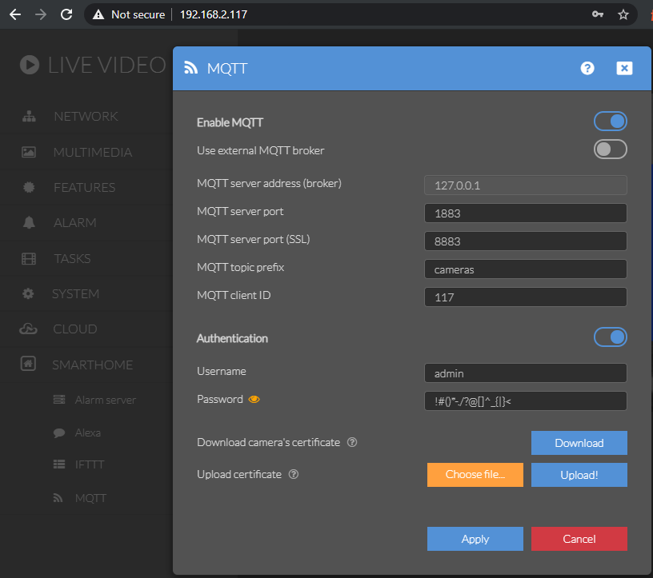
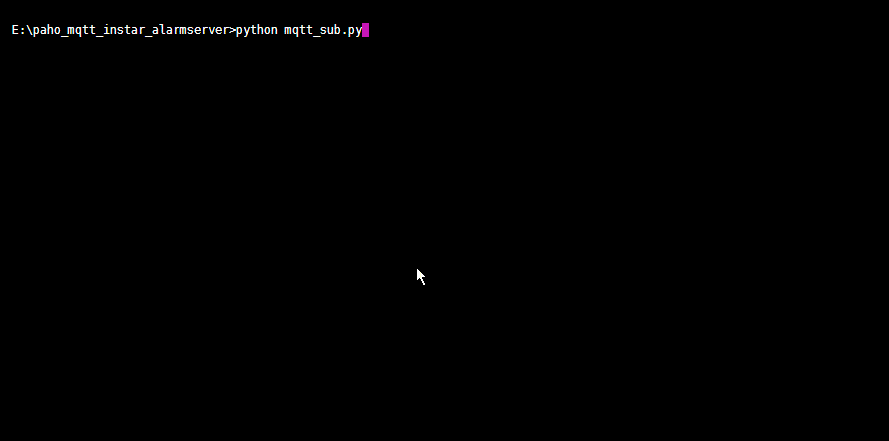

# INSTAR MQTT Alarmserver

INSTAR IP cameras offer an [MQTT Alarmserver](https://wiki.instar.com/Frequently_Asked_Question/INSTAR_MQTT_Alarmserver/) that you can use to react to different alarm triggers like motion detection, audio detection or PIR detection. The alarm server itself is an MQTT topic with a JSON formatted payload:

> __MQTT Topic__: `prefix/cameraID/status/alarm/triggered`

| MQTT Payload | Trigger Value | Description |
| -- | -- | -- |
| {"val":"1"} | 1 | Alarm Area 1 triggered |
| {"val":"2"} | 2 | Alarm Area 2 triggered |
| {"val":"3"} | 3 | Alarm Area 3 triggered |
| {"val":"4"} | 4 | Alarm Area 4 triggered |
| {"val":"5"} | 5 | Alarm-In / PIR triggered |
| {"val":"6"} | 6 | Audio Alarm triggered |
| {"val":"7"} | 7 | PIR & Area 1 triggered (coupled) |
| {"val":"8"} | 8 | PIR & Area 2 triggered (coupled) |
| {"val":"9"} | 9 | PIR & Area 3 triggered (coupled) |
| {"val":"10"} | 10 | PIR & Area 4 triggered (coupled) |
| {"val":"0"} | 0 | The alarm server returns to the idle `0` after 5s |

## Broker Configuration

I am using my INSTAR IP camera as MQTT Broker configured as follows:

## Paho MQTT Client

I now need a Python script to create an MQTT client. This script has to:

1. Connect to my MQTT broker using the paho_mqtt library
2. Create a wildcard subscription to the INSTAR alarm server topic that will receive status updates from all cameras connected to the MQTT broker
3. Extract the trigger value of each alarm update and make it available for further scripts that you can use to implement different actions based on the alarm trigger.

## Result

